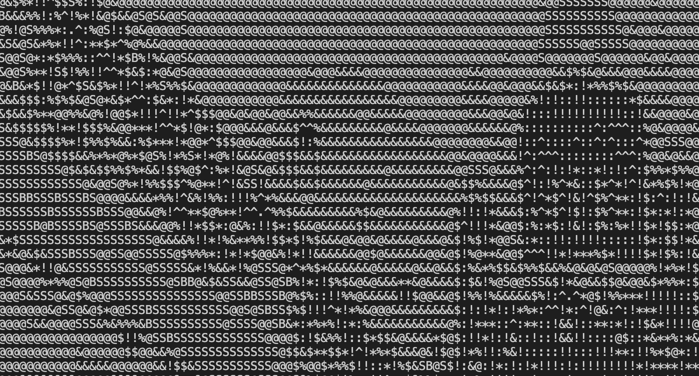

# _Random Pattern Generator_

#### _A Python app to generate ASCII art in a CLI environment using Pillow and the Lorem Picsum API, 8/9/2020_

#### By _**Hannah Beinstein**_

## Description

This is a Python CLI app that uses Pillow and the Lorem Picsum API (https://picsum.photos/) to fetch a random image, assign it a character based on its pixel value, and to print the resulting ASCII art to the console. 

<h1 align="center">
  

</h1>

## Setup/Installation Requirements

* _Clone or download this repository located at https://github.com/HBeinstein/Python_CLI_Pattern_Generator._
* _Run $python --version in your CLI to check if you have Python installed. If you don't, you can download it here: https://www.python.org/downloads/._
* _Open project in your code editor of choice._
* _Create a virtual environment in the project root directory by running $python3 -m venv venv. Once created, activate your virtual environment by running $source venv/bin/activate. (To deactivate a virtual environment, run $deactivate.)_
* _Once in a virtual environment, run $pip3 install -r requirements.txt to install all necessary project dependencies._
* _See the project in terminal by navigating to the project's root directory and running $python3 program.py._

## Known Bugs/Future Improvements

_No known bugs_

_Hoping to add light/dark mode and color functionality later on._
_Working on better contrast within the images and will try to add this soon_

## Support and contact details

_{Please contact me at hannah.beinstein@gmail.com with any known bugs or support issues.}_

## Technologies Used

* _Python_

## References!

* _https://medium.com/@03A_R/generating-ascii-art-from-colored-image-using-python-a044c29176b5!_

### License

*Copyright (c) 2020 **_Hannah Beinstein_**